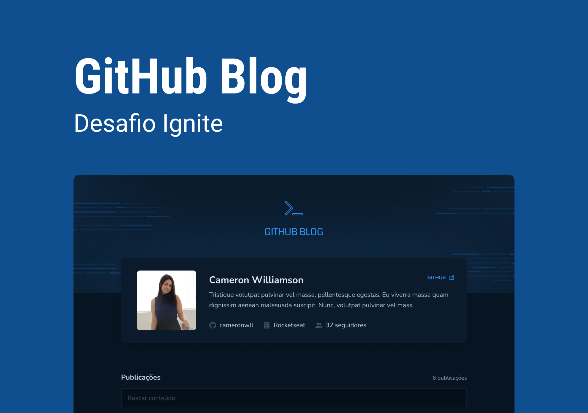

<h1 align="center">
    
</h1>

<p align="center">
 <a href="#-sobre-o-projeto">Sobre o Projeto</a> |
 <a href="#%EF%B8%8F-tecnologias">Tecnologias</a> |
 <a href="#-iniciando-o-projeto">Iniciando o projeto</a> |
 <a href="#-licença">Licença</a> |
 <a href="#-autor">Autor</a>
</p>

---

### 🎉 Sobre o projeto

Acompanha as últimas atualizações de issues do seu portfólio diretamente no Github Blog

O <b>Github Blog</b> é uma aplicação desenvolvida com React, serveless que utiliza a API
do [github](https://github.com) para exibir as issues de um repositório em formatod de blog

---

### 🛠️ Tecnologias

- [ReactJs](https://reactjs.org/)
- [Typescript](https://www.typescriptlang.org/)
- [Styled Components](https://styled-components.com/)
- [ViteJS](https://vitejs.dev/)
- [Axios](https://axios-http.com/docs/intro)

---

### 🚀 Iniciando o projeto

```bash
# Clonar aplicação

$ git clone https://github.com/MauricioAires/github-blog-airs

# Acessar a aplicação
$ cd github-blog-airs

# Execute yarn para instalar as dependências
$ npm i

# Para iniciar a aplicação
$ npm dev

```

---

### 📝 Licença

Distribuído sob a licença MIT.<br/>
Veja [LICENSE](LICENSE) para mais informações.

---

### 👨‍💻 Autor

Feito por Mauricio Aires 👋🏽
